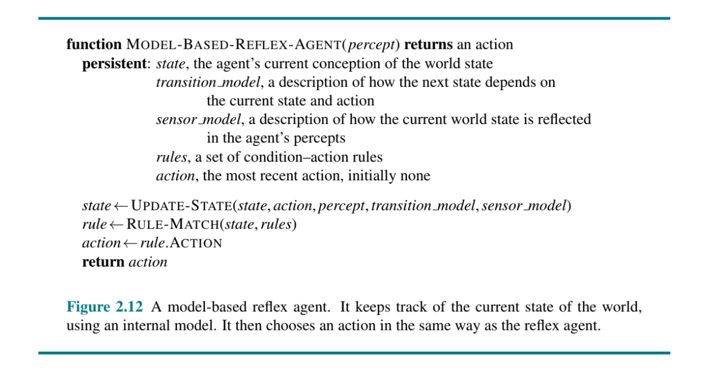

# Práctica Agente Inteligente

*Antonella Frattini - Curso de Especialización en IA y Big Data - IES de Teis*

#### Objetivo del proyecto
---
Este proyecto tiene como objetivo programar un agente inteligente para resolver el entorno de tareas del juego Piedra, Papel, Tijeras, siguiendo las directrices de modelado propuestas en el capítulo 2 (Intelligent Agents) del libro Artificial Intelligence: A Modern Approach de Russell y Norvig.

Para lograrlo, se llevará a cabo lo siguiente:

* Especificar las características del entorno de tareas.
* Identificar el tipo de agente adecuado para determinar su estructura.
* Implementar en Python los componentes necesarios para construir la función agente o función de mapeo entre percepciones y acciones.

#### Propiedades del entorno de tareas
---
| Entorno de tareas | Observable | Agentes | Determinista | Episódico | Estático | Discreto | Conocido |
|---------------------|------------|---------|--------------|-----------|----------|----------|----------|
| RPS                 | Parcialmente | Múltiples | No | Si         | Si        | Si        | Si        |

* **Totalmente observable vs. parcialmente observable:** El entorno es ***parcialmente observable*** ya que no todos los aspectos que son relevantes para la elección de la acción son conocidos, en particular, no sabe cual será la jugada del otro agente.

* **Agente único vs. multiagente:** En este caso, es un entorno ***multiagente***, ya que hay dos jugadores que se enfrentan. Cada agente está tratando de maximizar su rendimiento y el éxito de cada uno depende de lo que el otro haga.

* **Determinista vs. no determinista:** El siguiente estado del entorno no está completamente determinado por el estado actual y la acción ejecutada por los jugadores, por lo que es ***no determinista***.

* **Episódico vs. secuencial:** El entorno es ***episódico*** ya que la decición que está tomando no afecta a las futuras.

* **Estatico vs. dinámico:** Es ***estático*** porque el entorno no cambia mientras el agente está tomando una decisión.

* **Discreto vs. contínuo:**  El entorno es ***discreto*** debido a que el número de acciones y percepciones son finitas.

* **Conocido vs. desconocido:** Los jugadores saben las reglas del juego en todo momento, las cuales son claras y bien definidas, por lo que el entorno es considerado ***conocido***.

#### Estructura del agente

Luego de analizar cada uno de los cuatro tipos de agentes propuestos en la teoría, se ha elegido para esta práctica desarrollar un ***agente basado en modelos***, ya que este es particularmente adecuado para entornos parcialmente observables. En el juego Piedra, Papel o Tijeras, el agente no sabe qué jugará el oponente, pero puede analizar el historial de jugadas recientes (Estado). Con esta información, toma su "mejor suposición" y elige la opción que contrarresta la jugada más frecuente del oponente (Reglas condicionales), aumentando así sus posibilidades de ganar.

#### Implementación en Python

Según la teoría, la función de un agente basado en modelos sería la siguiente: 

