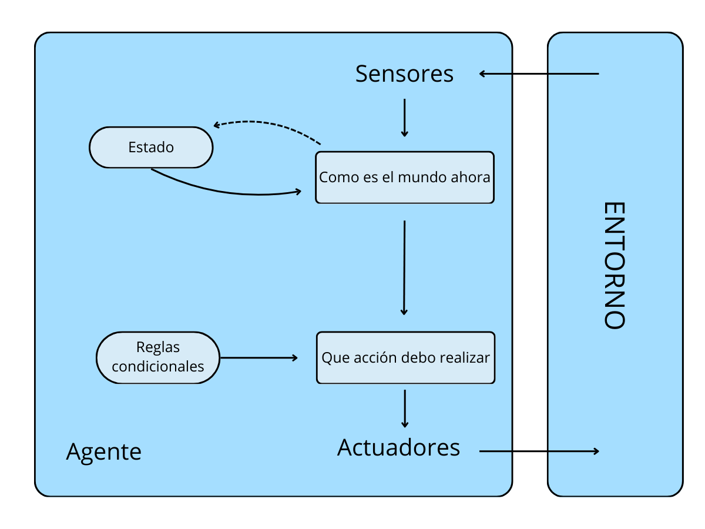

# Práctica Agente Inteligente

*Antonella Frattini - Curso de Especialización en IA y Big Data - IES de Teis*

## Objetivo del proyecto

Este proyecto tiene como objetivo programar un agente inteligente para resolver el entorno de tareas del juego Piedra, Papel, Tijeras, siguiendo las directrices de modelado propuestas en el capítulo 2 (Intelligent Agents) del libro Artificial Intelligence: A Modern Approach de Russell y Norvig.

Para lograrlo, se llevará a cabo lo siguiente:

* Especificar las características del entorno de tareas.
* Identificar el tipo de agente adecuado para determinar su estructura.
* Implementar en Python los componentes necesarios para construir la función agente o función de mapeo entre percepciones y acciones.

## Propiedades del entorno de tareas

| Entorno de tareas | Observable | Agentes | Determinista | Episódico | Estático | Discreto | Conocido |
|---------------------|------------|---------|--------------|-----------|----------|----------|----------|
| RPS                 | Parcialmente | Múltiples | No | Si         | Si        | Si        | Si        |

* **Totalmente observable vs. parcialmente observable:** El entorno es ***parcialmente observable*** ya que no todos los aspectos que son relevantes para la elección de la acción son conocidos, en particular, no sabe cual será la jugada del otro agente.

* **Agente único vs. multiagente:** En este caso, es un entorno ***multiagente***, ya que hay dos jugadores que se enfrentan. Cada agente está tratando de maximizar su rendimiento y el éxito de cada uno depende de lo que el otro haga.

* **Determinista vs. no determinista:** El siguiente estado del entorno no está completamente determinado por el estado actual y la acción ejecutada por los jugadores, por lo que es ***no determinista***.

* **Episódico vs. secuencial:** El entorno es ***episódico*** ya que la decición que está tomando no afecta a las futuras.

* **Estatico vs. dinámico:** Es ***estático*** porque el entorno no cambia mientras el agente está tomando una decisión.

* **Discreto vs. contínuo:**  El entorno es ***discreto*** debido a que el número de acciones y percepciones son finitas.

* **Conocido vs. desconocido:** Los jugadores saben las reglas del juego en todo momento, las cuales son claras y bien definidas, por lo que el entorno es considerado ***conocido***.

## Estructura del agente

Luego de analizar cada uno de los cuatro tipos de agentes propuestos en la teoría, se ha elegido para esta práctica desarrollar un ***agente basado en modelos***, ya que este es particularmente adecuado para entornos parcialmente observables. En el juego Piedra, Papel o Tijeras, el agente no sabe qué jugará el oponente, pero puede analizar el historial de jugadas recientes (Estado). Con esta información, toma su "mejor suposición" y elige la opción que contrarresta la jugada más frecuente del oponente (Reglas condicionales), aumentando así sus posibilidades de ganar.

## Implementación en Python

La implementación del agente se lleva a cabo en la función ***get_computer_action()***, que mantiene un historial de las jugadas realizadas por el oponente. La estrategia del agente para maximizar sus probabilidades de ganar consiste en analizar las últimas 10 jugadas del historial y seleccionar la opción que contrarresta la jugada más frecuente del oponente. En un principio se tenía en cuenta todo el historial de jugadas, pero el código se ha adaptado para que al considerar solo lás últimas 10, el agente puede ir adaptándose a los cambios de estrategia de su oponente.

La función recibe como parámetro la última jugada del oponente (*user_action*) y va añadiendolas al historial (*opponent_history*), el cual se crea solo la primera vez que se llama a la función. Tal como comenté previamente, de las últimas 10 jugadas se obtiene la más frecuente (*most_common_move*) y elige la jugada que la contrarestra.

## Extención del juego a Lagarto y Spock

Por último, se pide extender el juego a "Rock, Paper, Scissors, Lizard, Spock". Para lograrlo, además de agregar estas dos opciones extras a *GameAction*, he modificado las funciones *get_computer_action* y *asses_game*.

La función ***get_computer_action*** se ha adaptado de manera que se incluyan las opciones de "Spock" y "Lizard" en las condiciones de decisión del agente. En la función ***asses_game***, además de agregar la lógica para estas dos nuevas opciones, se han ajustado las condiciones existentes para que se adapten a la nueva modalidad. Anteriormente, si el usuario elegía Paper se evaluaba unicamente si el Agente había elegido Rock (*if computer_action == GameAction.Rock*) y daba la partida como ganada; sino, la perdía. Ahora, dado que en el juego RPSLS cada movimiento gana contra dos y pierde contra otros dos,  se ha modificado la lógica para que busque en una lista con los dos valores a los que le gana (*if computer_action in [GameAction.Paper, GameAction.Lizard]*).

## Instrucciones de instalación y uso

Para instalar y probar el programa se deben realizar los siguientes pasos:

1. Abrir una terminal y clonar el proyecto:
   <code> git clone https://github.com/aFrattini/piedra-papel-tijeras.git </code>
   
2. Crear el entorno virtual:
   <code> python -m venv env_rps </code>

3. Activar el entorno virtual:
-Linux/Mac
   <code>source env_rps/bin/activate</code>
-Windows
   <code>.\env_rps\Scripts\activate</code>

4. Instalar dependencias (dentro de la carpeta del proyecto):
   <code>cd .\piedra-papel-tijeras\</code>
   <code>pip install -r requirements.txt</code>

5. Ejecutar el juego:
   <code>cd src</code>
   <code>python game.py</code>

